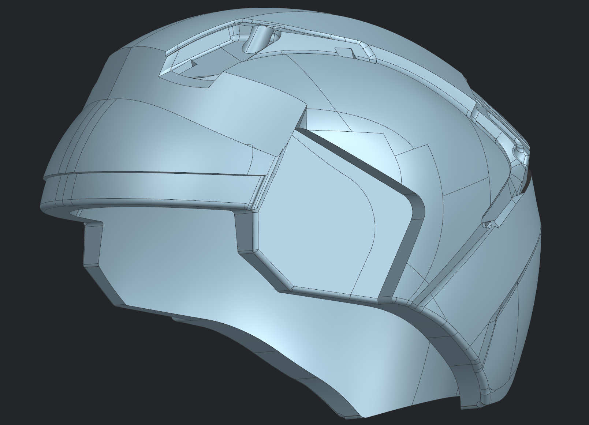
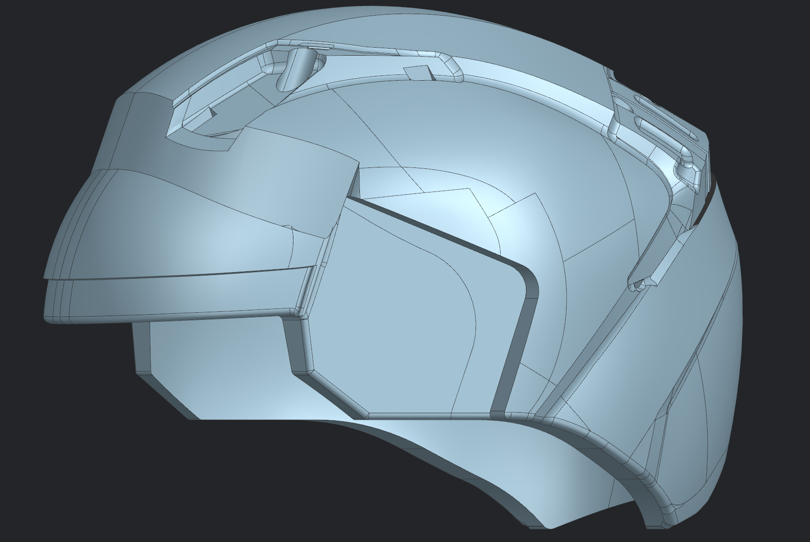
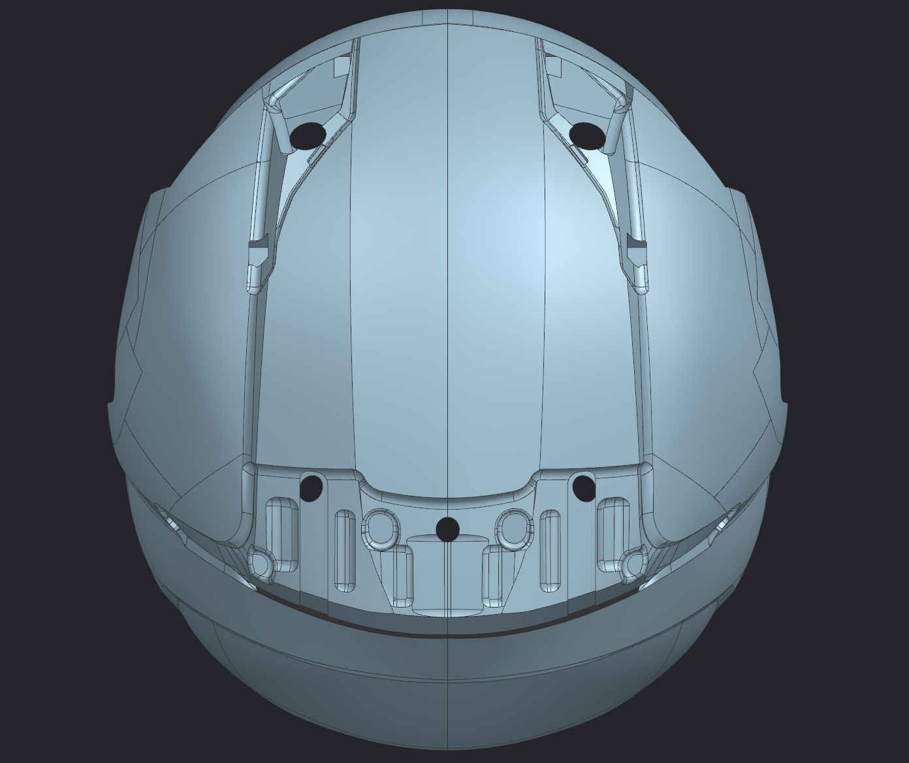
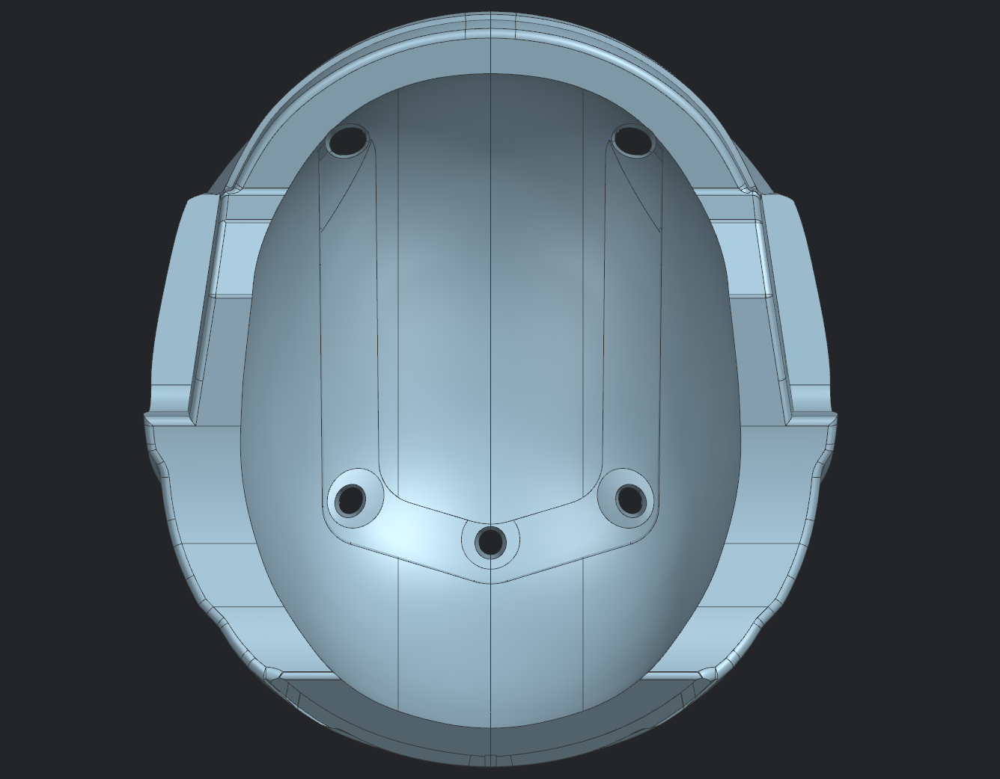
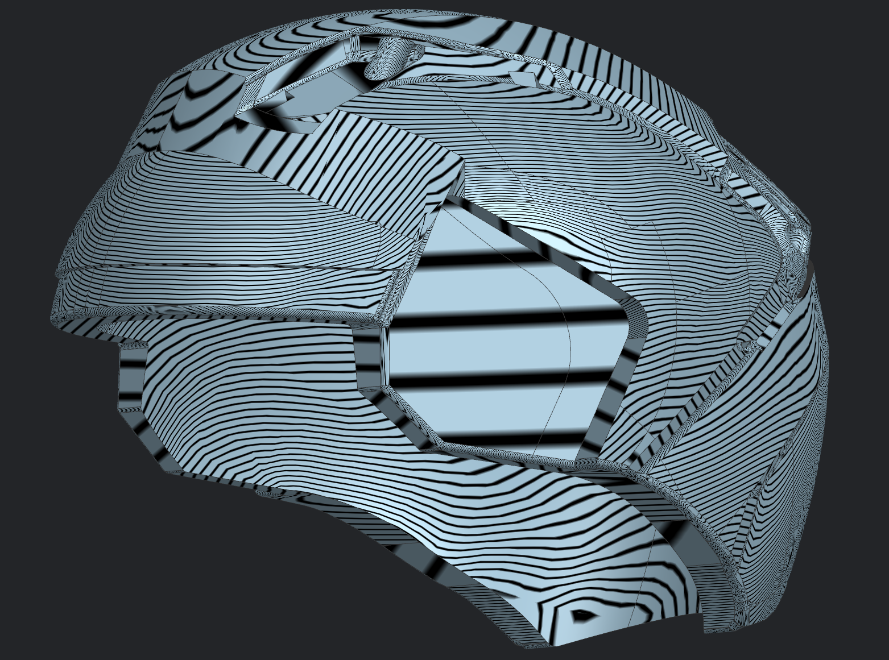
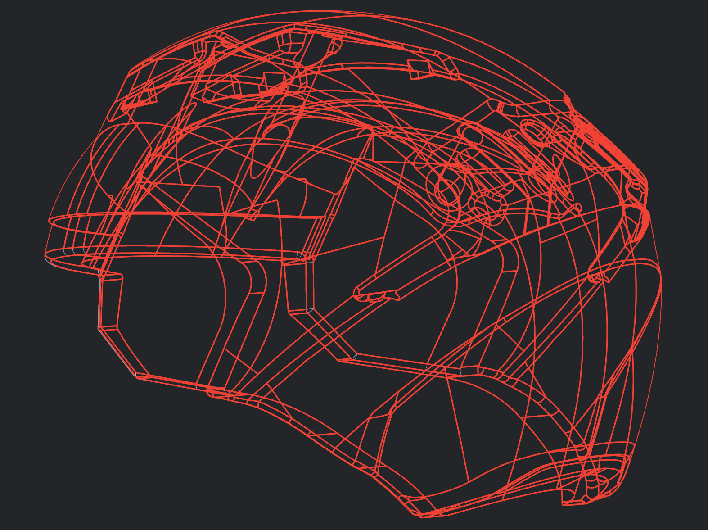

# Helmet 05 - Complete Helmet Assembly

## Overview

This project showcases the complete development of a production-style helmet in Siemens NX by integrating both the outer Class A surface and the inner liner surface into a fully assembled model.

The helmet incorporates complex styling features, vent openings, mounting bosses, internal support geometry, and multiple intersecting surface patches. All individual surfaces were carefully constructed, trimmed, and sewn into complete bodies while maintaining high-quality surface continuity throughout the model.

---

## Project Highlights

- Developed complete outer Class A helmet surface
- Developed matching inner liner surface
- Integrated both surfaces into a complete helmet assembly
- Created vent openings, mounting features and internal geometry
- Built complex freeform surfaces with controlled continuity
- Sewn all individual surface patches into complete bodies
- Validated surface quality using Zebra Analysis

---

## Siemens NX Tools Used

- Studio Surface
- Through Curve
- Through Curve Mesh
- Bridge Curve
- Spline
- Trim Sheet
- Split Body
- Sew
- Delete Body
- Sketch
- Datum Plane
- Surface Analysis (Zebra)

---

## Gallery

### Complete Helmet (Trimetric)

### Side View

### Top View

### Bottom View

### Zebra Analysis

### Wireframe

---

## Note

This project represents one of the most comprehensive helmet surfacing exercises completed during my industrial training at Vega Helmets. The objective was to create a production-style helmet by developing both the Class A exterior and the inner liner surfaces, integrating them into a complete model while maintaining smooth surface continuity, manufacturable geometry, and clean transitions across all visible regions.
