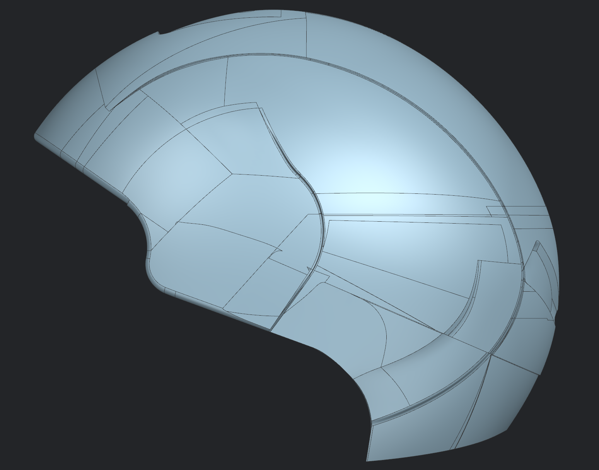
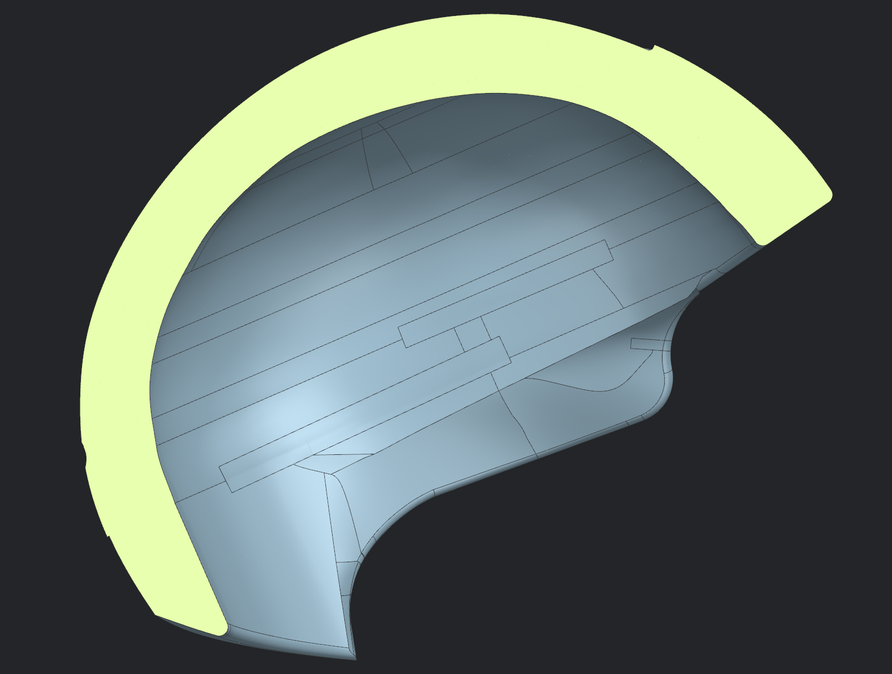
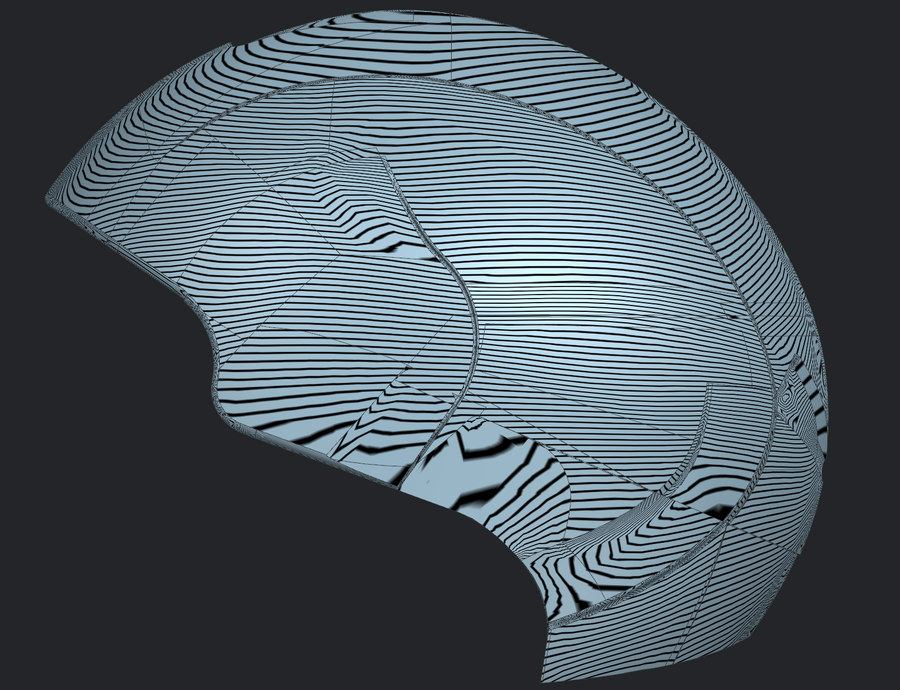
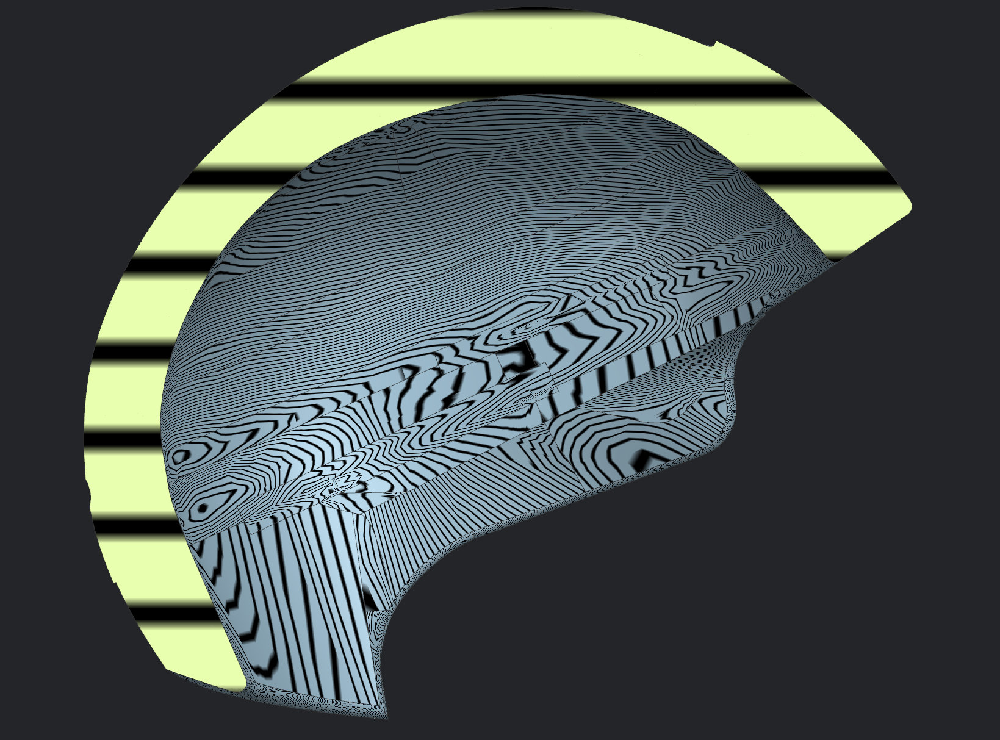

# Helmet 06 – Production Surface Patchwork

---

## Overview

This project involved localized Class A surface patchwork on a production helmet model using Siemens NX. The objective was to reconstruct and refine selected surface regions while preserving the original design intent and achieving manufacturing-ready surface quality.

The repaired surfaces were created using advanced surfacing techniques, sewn into the existing geometry, and validated using Siemens NX surface analysis tools to ensure smooth transitions and geometric continuity.
---

## Process

The workflow included:

- Surface patch reconstruction
- Boundary curve refinement
- Surface extension and trimming
- Surface matching
- Edge blending
- Surface sewing
- Continuity verification
- Manufacturing surface preparation

---

## Gallery

### Outside Surface

---

### Inside Surface

---

### Outside Surface – Zebra Analysis

---

### Inside Surface – Zebra Analysis

---

## Software Used

**Software**
- Siemens NX

**Surface Modelling Tools**
- Splines
- Fill Surface
- Through Curve Mesh
- Studio Surface (N-Sided)
- Delete Edge
- Delete Body
- Trim Sheet
- Project Curves
- Extend Sheet
- Sew

**Surface Validation**
- Examine Geometry
- Zebra Analysis

---

## Note

This project demonstrates localized Class A surface patchwork performed on a production helmet model. Both the outer shell and inner surfaces were reconstructed and validated using Zebra Analysis to ensure smooth transitions, geometric continuity, and manufacturing-ready surface quality.
