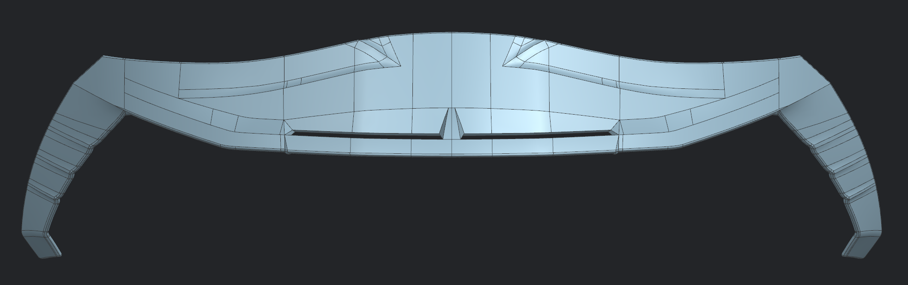
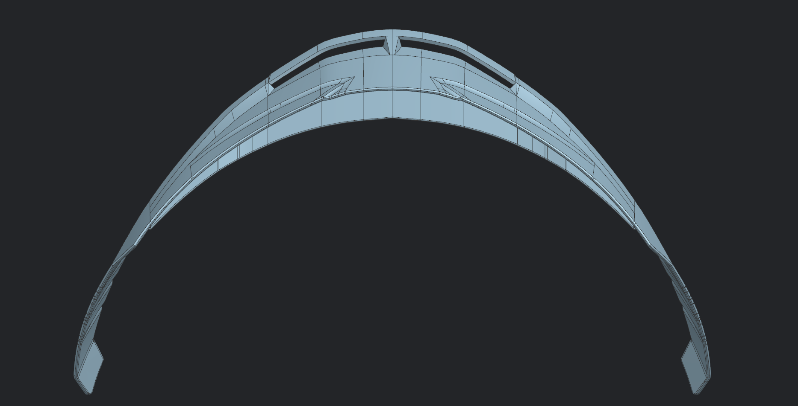
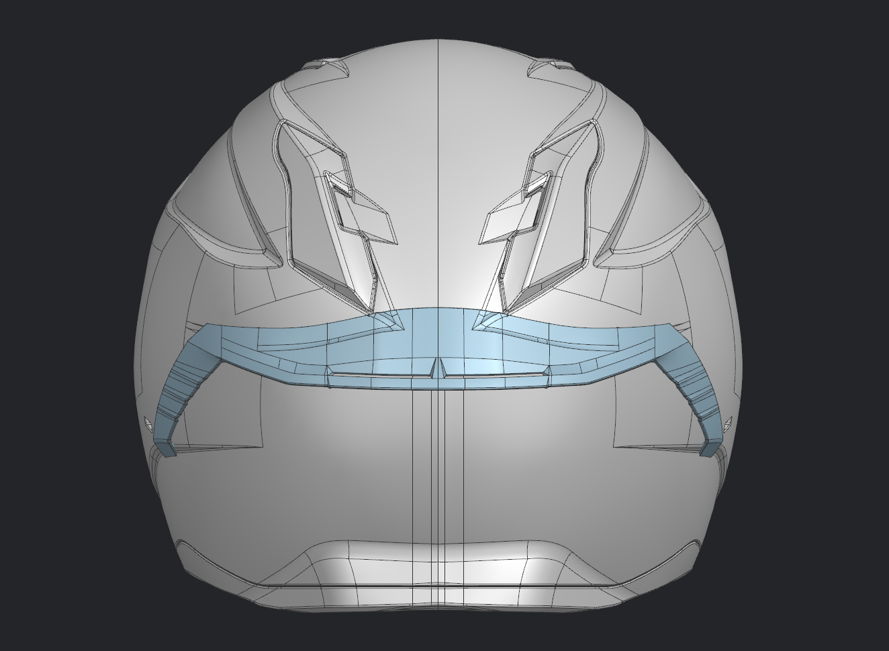
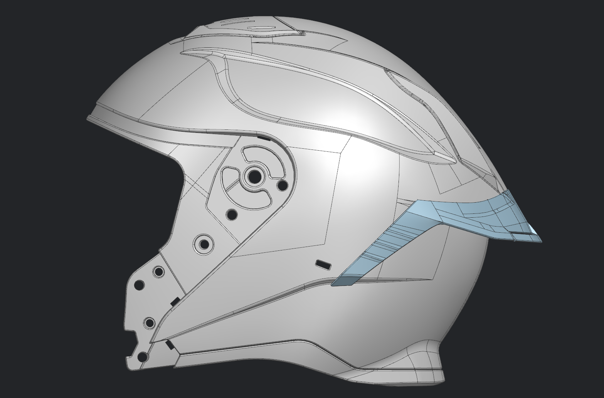

### Helmet 07 – Rear Spoiler Surface Development

## Overview

This project involved the Class A surface development of a production motorcycle helmet rear spoiler in Siemens NX. The objective was to create a manufacturable spoiler component that integrates seamlessly with the existing helmet geometry while maintaining smooth surface continuity and production-quality aesthetics.

The spoiler was developed as an independent surface model, fitted to the helmet assembly, and validated to ensure high-quality transitions suitable for tooling and manufacturing.

---

## Project Highlights

- Developed a production-ready rear spoiler for a motorcycle helmet.
- Created Class A surfaces using advanced Siemens NX surfacing workflows.
- Integrated the spoiler with the helmet assembly while maintaining smooth geometric transitions.
- Verified surface continuity through Zebra Analysis.
- Prepared manufacturable surface geometry for downstream engineering.

---

## Gallery

### Spoiler

| Spoiler Front View | Spoiler Top View |
|-------------------|------------------|
|  |  |

### Integrated with Helmet

| Front View | Side View |
|----------------------------------|---------------------------------|
|  |  |

---

## Software Used

### Software
- Siemens NX

### Surface Modelling Tools
- Splines
- Fill Surface
- Through Curve Mesh
- Studio Surface (N-Sided)
- Project Curves
- Trim Sheet
- Extend Sheet
- Sew

### Surface Validation
- Examine Geometry
- Zebra Analysis

---

## Skills Demonstrated

- Class A Surface Modelling
- Advanced Surface Repair
- Surface Continuity (G0/G1/G2)
- Surface Integration
- Production Surface Development
- Surface Validation
- CAD for Manufacturing

---

## Note:

This project was completed as part of an industrial training assignment at Vega Auto Accessories Pvt. Ltd. The rear spoiler was developed for a production motorcycle helmet, with the objective of creating a manufacturable Class A surface that integrates seamlessly with the existing helmet geometry while meeting industrial surfacing standards.
